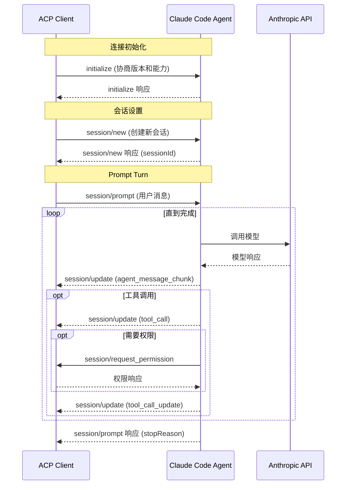

# ACP Client - Claude Code 通信客户端技术方案

> 最后更新时间：2026/01/30

## 目录

- [项目概述](#项目概述)
- [架构设计](#架构设计)
- [技术栈](#技术栈)
- [数据模型](#数据模型)
- [Claude Code 集成](#claude-code-集成)
- [IPC 通信设计](#ipc-通信设计)
- [前端实现](#前端实现)
- [项目结构](#项目结构)
- [实施步骤](#实施步骤)
- [关键技术难点](#关键技术难点)
- [扩展功能](#扩展功能)

---

## 项目概述

### 目标

开发一个基于 Electron 的桌面应用，通过 ACP（Agent Client Protocol）与 Claude Code 进行通信，实现：

- 多会话并行（每个会话独立的 Claude Code 进程）
- 完整会话记录持久化
- 流式消息响应
- 简洁现代的聊天界面

### 核心价值

**ACP 通信的本质**：

```
你（ACP Client）
↔ Claude Code 进程（ACP Agent Server）
↔ Claude LLM（由 Claude Code 自己负责）
```

- 通信对象是 **Claude Code 本地/远程 Agent 进程**，不是模型本身
- Claude Code 在这里扮演的是一个 **ACP Agent Server**
- 通过 stdin/stdout 进行 JSON-RPC 通信（类似 LSP）

---

## 架构设计

### 整体架构

```
┌─────────────────────────────────────────────┐
│          Electron 主进程                     │
│  ┌────────────────────────────────────────┐ │
│  │ Session Manager                         │ │
│  │  - 管理多个 Claude Code 子进程          │ │
│  │  - 每个会话一个独立 claude-code 实例    │ │
│  └────────────────────────────────────────┘ │
│  ┌────────────────────────────────────────┐ │
│  │ SQLite Database Manager                │ │
│  │  - conversations                        │ │
│  │  - messages                             │ │
│  │  - tool_calls                           │ │
│  └────────────────────────────────────────┘ │
│  ┌────────────────────────────────────────┐ │
│  │ Config Manager                          │ │
│  │  - 读取 ~/.claude/settings.json         │ │
│  └────────────────────────────────────────┘ │
└─────────────────────────────────────────────┘
              ↕ IPC (contextBridge)
┌─────────────────────────────────────────────┐
│          Electron 渲染进程                   │
│  ┌────────────────────────────────────────┐ │
│  │ React App                               │ │
│  │  ┌──────────────┬───────────────────┐  │ │
│  │  │ 左侧边栏     │ 右侧聊天窗口      │  │ │
│  │  │ - 会话列表   │ - 消息流         │  │ │
│  │  │ - 新建会话   │ - 输入框         │  │ │
│  │  │ - 搜索过滤   │ - 工具调用展示   │  │ │
│  │  └──────────────┴───────────────────┘  │ │
│  │                                         │ │
│  │ Zustand State:                          │ │
│  │  - conversations[]                      │ │
│  │  - currentConversationId                │ │
│  │  - messages[]                           │ │
│  └────────────────────────────────────────┘ │
└─────────────────────────────────────────────┘
```

### 进程通信流程

1. **渲染进程** → 调用 `window.electronAPI.sendMessage()`
2. **主进程 IPC Handler** → 接收请求
3. **SessionManager** → 获取/创建 Claude 会话
4. **ClaudeCodeProcess** → 调用 Claude Agent SDK
5. **流式响应** → 通过 `MESSAGE_STREAM` 通道实时发送
6. **渲染进程 Zustand Store** → 更新状态，UI 自动刷新

---

## 技术栈

### 核心技术

- **Electron** - 桌面应用框架（主进程 + 渲染进程 + Preload 沙箱）
- **React 18** - UI 框架
- **TypeScript** - 类型系统
- **Zustand** - 轻量级状态管理（**注意：必须使用 `import { create } from 'zustand/react'` 引入**）
- **SQLite3** - 本地数据库
- **@anthropic-ai/claude-agent-sdk** - Claude Code SDK
- **Vercel AI SDK** - 流式文本处理

### 脚手架

- **electron-react-boilerplate** - 提供开箱即用的 Webpack 配置、热重载、打包工具

### 依赖管理

采用 **两个 package.json** 结构：

```
./package.json           # 开发依赖（webpack, babel, react 等）
./release/app/package.json  # 生产依赖（原生模块：sqlite3 等）
```

这种结构可以显著减少打包后的应用体积。

---

## 数据模型

### SQLite Schema

#### 1. 会话表（conversations）

```sql
CREATE TABLE conversations (
  id TEXT PRIMARY KEY,          -- UUID
  title TEXT NOT NULL,          -- 会话标题
  created_at INTEGER NOT NULL,  -- 创建时间戳
  updated_at INTEGER NOT NULL,  -- 更新时间戳
  status TEXT DEFAULT 'active', -- active | archived
  claude_session_id TEXT        -- Claude Code 的 session ID (用于恢复)
);

CREATE INDEX idx_conversations_updated ON conversations(updated_at DESC);
```

#### 2. 消息表（messages）

```sql
CREATE TABLE messages (
  id TEXT PRIMARY KEY,
  conversation_id TEXT NOT NULL,
  role TEXT NOT NULL,           -- user | assistant | system
  content TEXT,                 -- 文本内容
  created_at INTEGER NOT NULL,
  metadata TEXT,                -- JSON: { tokens, model, etc }
  FOREIGN KEY (conversation_id) REFERENCES conversations(id) ON DELETE CASCADE
);

CREATE INDEX idx_messages_conversation ON messages(conversation_id);
```

#### 3. 工具调用记录表（tool_calls）

```sql
CREATE TABLE tool_calls (
  id TEXT PRIMARY KEY,
  message_id TEXT NOT NULL,
  tool_name TEXT NOT NULL,      -- 工具名称
  input TEXT,                   -- JSON 输入
  output TEXT,                  -- JSON 输出
  status TEXT DEFAULT 'pending', -- pending | success | error
  created_at INTEGER NOT NULL,
  FOREIGN KEY (message_id) REFERENCES messages(id) ON DELETE CASCADE
);

CREATE INDEX idx_tool_calls_message ON tool_calls(message_id);
```

### TypeScript 类型定义

```typescript
// src/types/conversation.ts
export interface Conversation {
  id: string;
  title: string;
  createdAt: number;
  updatedAt: number;
  status: 'active' | 'archived';
  claudeSessionId?: string;
}

export interface Message {
  id: string;
  conversationId: string;
  role: 'user' | 'assistant' | 'system';
  content: string;
  createdAt: number;
  metadata?: {
    tokens?: number;
    model?: string;
    reasoning?: string;
  };
}

export interface ToolCall {
  id: string;
  messageId: string;
  toolName: string;
  input: any;
  output?: any;
  status: 'pending' | 'success' | 'error';
  createdAt: number;
}
```

---

## Claude Code 集成

### 集成方案：使用 @agentclientprotocol/sdk 实现 ACP 通信

本项目使用 **@agentclientprotocol/sdk** 作为 ACP Client，通过 **stdio** 与 **Claude Code Agent** 子进程进行通信。这是真正的 ACP（Agent Client Protocol）实现。

#### 架构说明

```
┌─────────────────────────────────────────────────────────────┐
│                    Electron 主进程                           │
│  ┌───────────────────────────────────────────────────────┐  │
│  │ ACPClient (使用 @agentclientprotocol/sdk)             │  │
│  │   - ClientSideConnection                              │  │
│  │   - JSON-RPC 2.0 over stdio                           │  │
│  └─────────────────────────┬─────────────────────────────┘  │
└────────────────────────────┼────────────────────────────────┘
                             │ stdin/stdout (JSON-RPC)
┌────────────────────────────▼────────────────────────────────┐
│              Claude Code Agent 子进程                        │
│    (通过 `claude --acp` 启动)                                │
│                             │                                │
│                             ▼                                │
│                    Anthropic API                             │
└─────────────────────────────────────────────────────────────┘
```

**关键点**：
- **真正的 ACP 协议通信**：使用 `@agentclientprotocol/sdk` 建立与 Agent 的连接
- **stdio 传输层**：Client 启动 Agent 子进程，通过 stdin/stdout 交换 JSON-RPC 消息
- **Agent 能力**：Claude Code Agent 具备文件读写、终端执行、工具调用等能力
- **双向通信**：Client 发送 prompt，Agent 通过 notifications 实时更新状态
- **权限控制**：Agent 可以请求 Client 授权工具调用

#### ACPClient 类

```typescript
// src/main/acp/ACPClient.ts
import { spawn, ChildProcess } from 'child_process';

export interface ACPClientConfig {
  agentCommand?: string[];  // 默认: ['claude-code-acp']
  workingDir?: string;
}

export class ACPClient {
  private agentProcess: ChildProcess | null = null;
  private connection: ClientSideConnection | null = null;
  private config: ACPClientConfig;

  constructor(config: ACPClientConfig = {}) {
    this.config = {
      // 使用 @zed-industries/claude-code-acp 适配器
      // 需要先安装: npm install -g @zed-industries/claude-code-acp
      agentCommand: config.agentCommand || ['claude-code-acp'],
      workingDir: config.workingDir || process.cwd(),
    };
  }

  /**
   * 启动 Agent 子进程并建立 ACP 连接
   */
  async connect(): Promise<void> {
    const [cmd, ...args] = this.config.agentCommand!;
    
    // 1. 启动 Agent 子进程
    this.agentProcess = spawn(cmd, args, {
      cwd: this.config.workingDir,
      stdio: ['pipe', 'pipe', 'pipe'],
      env: { ...process.env },  // 传递环境变量（包括 ANTHROPIC_API_KEY）
    });
    
    // 2. 初始化握手
    await this.connection.initialize({
      clientInfo: { name: 'acp-client', version: '1.0.0' },
      capabilities: {
        'fs.readTextFile': true,
        'fs.writeTextFile': true,
        terminal: true,
      },
    });
  }

  /**
   * 创建新会话
   */
  async newSession(sessionId?: string): Promise<ACPSession> {
    if (!this.connection) {
      throw new Error('Not connected');
    }
    const result = await this.connection.newSession({ sessionId });
    return new ACPSession(this.connection, result.sessionId);
  }

  /**
   * 关闭连接
   */
  async disconnect(): Promise<void> {
    if (this.agentProcess) {
      this.agentProcess.kill();
      this.agentProcess = null;
    }
    this.connection = null;
  }
}
```

#### ACPSession 类

```typescript
// src/main/acp/ACPSession.ts
import { ClientSideConnection } from '@agentclientprotocol/sdk';
import type { SessionUpdate, PromptResult } from '@agentclientprotocol/sdk';

export class ACPSession {
  private connection: ClientSideConnection;
  private sessionId: string;
  private updateListeners: ((update: SessionUpdate) => void)[] = [];

  constructor(connection: ClientSideConnection, sessionId: string) {
    this.connection = connection;
    this.sessionId = sessionId;
  }

  /**
   * 发送 prompt 并等待完成
   */
  async prompt(
    content: string,
    onUpdate?: (update: SessionUpdate) => void
  ): Promise<PromptResult> {
    // 注册更新回调
    const listener = (update: SessionUpdate) => {
      if (update.sessionId === this.sessionId && onUpdate) {
        onUpdate(update);
      }
    };
    this.updateListeners.push(listener);
    
    try {
      // 发送 session/prompt
      const result = await this.connection.prompt({
        sessionId: this.sessionId,
        prompt: [{ type: 'text', text: content }],
      });
      
      return result;
    } finally {
      // 移除监听器
      const index = this.updateListeners.indexOf(listener);
      if (index > -1) this.updateListeners.splice(index, 1);
    }
  }

  /**
   * 取消当前请求
   */
  async cancel(): Promise<void> {
    await this.connection.cancel();
  }

  getSessionId(): string {
    return this.sessionId;
  }
}
```

### ConfigManager - 读取 Claude 配置

ConfigManager 负责读取 `~/.claude/settings.json` 配置文件，并提供 API Key、模型等配置信息。

#### 配置文件示例

`~/.claude/settings.json` 格式示例：

```json
{
  "model": "sonnet",
  "env": {
    "ANTHROPIC_API_KEY": "sk-ant-...",
    "ANTHROPIC_AUTH_TOKEN": "..."
  },
  "apiKeyHelper": "~/scripts/get-claude-key.sh",
  "permissions": {
    "allow": ["read", "write", "execute"],
    "deny": [],
    "additionalDirectories": ["/Users/username/projects"],
    "defaultMode": "ask"
  }
}
```

**配置项说明**：
- **model**: 模型名称（如 'sonnet', 'opus', 'haiku'）
- **env**: 环境变量（API Key、Auth Token 等）
- **apiKeyHelper**: 获取 API Key 的脚本路径（支持 `~` 展开）
- **permissions**: 工具权限配置（由 Claude Code SDK 自动处理）

#### ConfigManager 实现

```typescript
// src/main/managers/ConfigManager.ts
import fs from 'fs';
import path from 'path';
import os from 'os';
import { execSync } from 'child_process';

export interface ClaudeSettings {
  model?: string;
  env?: Record<string, string>;
  apiKeyHelper?: string;
  permissions?: {
    allow?: string[];
    deny?: string[];
    additionalDirectories?: string[];
    defaultMode?: string;
  };
}

export class ConfigManager {
  private settingsPath: string;
  private settings: ClaudeSettings | null = null;

  constructor() {
    this.settingsPath = path.join(os.homedir(), '.claude', 'settings.json');
  }

  /**
   * 读取 Claude settings.json
   */
  readSettings(): ClaudeSettings {
    try {
      if (fs.existsSync(this.settingsPath)) {
        const content = fs.readFileSync(this.settingsPath, 'utf-8');
        this.settings = JSON.parse(content);
        return this.settings!;
      }
    } catch (error) {
      console.error('Failed to read Claude settings:', error);
    }

    // 返回默认配置
    this.settings = { model: 'sonnet' };
    return this.settings;
  }

  /**
   * 获取 API Key 或 Auth Token
   * 优先级: 环境变量 > apiKeyHelper > settings.json
   */
  getApiKey(): string | undefined {
    // 1. 环境变量 - API Key
    if (process.env.ANTHROPIC_API_KEY) {
      return process.env.ANTHROPIC_API_KEY;
    }

    // 2. 环境变量 - Auth Token
    if (process.env.ANTHROPIC_AUTH_TOKEN) {
      return process.env.ANTHROPIC_AUTH_TOKEN;
    }

    // 3. apiKeyHelper 脚本
    const settings = this.getSettings();
    if (settings.apiKeyHelper) {
      const key = this.executeApiKeyHelper(settings.apiKeyHelper);
      if (key) return key;
    }

    // 4. settings.json 中的 env.ANTHROPIC_API_KEY
    if (settings.env?.ANTHROPIC_API_KEY) {
      return settings.env.ANTHROPIC_API_KEY;
    }

    // 5. settings.json 中的 env.ANTHROPIC_AUTH_TOKEN
    if (settings.env?.ANTHROPIC_AUTH_TOKEN) {
      return settings.env.ANTHROPIC_AUTH_TOKEN;
    }

    return undefined;
  }

  /**
   * 获取模型名称
   */
  getModel(): string {
    const settings = this.getSettings();
    return (
      process.env.ANTHROPIC_MODEL ||
      settings.model ||
      'sonnet'
    );
  }

  /**
   * 执行 apiKeyHelper 脚本获取 API Key
   */
  private executeApiKeyHelper(script: string): string | undefined {
    try {
      // 展开 ~ 路径
      const expandedScript = script.replace(/^~/, os.homedir());

      const result = execSync(expandedScript, {
        encoding: 'utf-8',
        timeout: 5000,
        stdio: ['pipe', 'pipe', 'ignore'], // 忽略 stderr
      });

      return result.trim();
    } catch (error) {
      console.error('Failed to execute apiKeyHelper:', error);
      return undefined;
    }
  }

  /**
   * 刷新配置（重新读取文件）
   */
  refresh(): ClaudeSettings {
    this.settings = null;
    return this.readSettings();
  }

  private getSettings(): ClaudeSettings {
    if (!this.settings) {
      return this.readSettings();
    }
    return this.settings;
  }
}
```

#### Provider 配置

Claude Code Agent 支持多种 Provider，可以通过环境变量配置：

```bash
# 默认使用 Anthropic API
export ANTHROPIC_API_KEY="sk-ant-..."

# 使用 Amazon Bedrock
export AWS_REGION="us-west-2"
export AWS_ACCESS_KEY_ID="..."
export AWS_SECRET_ACCESS_KEY="..."

# 使用 Google Vertex AI
export GOOGLE_VERTEX_PROJECT_ID="..."
export GOOGLE_VERTEX_LOCATION="us-central1"
export GOOGLE_APPLICATION_CREDENTIALS="/path/to/credentials.json"
```

**注意**：
- Claude Code Agent 会自动读取 `~/.claude/settings.json`
- Agent 会根据环境变量自动选择合适的 Provider
- 我们的 ConfigManager 主要用于应用层的配置管理

---

## ACP 通信流程

### ACP 协议核心概念

ACP (Agent Client Protocol) 基于 **JSON-RPC 2.0** 规范，通过 **stdio** 传输层进行通信。

### 消息类型

- **Methods**: 请求-响应对，期望收到结果或错误
- **Notifications**: 单向消息，不期望响应

### 消息流程图



### 核心 ACP 方法

| 方法 | 方向 | 说明 |
|------|------|------|
| `initialize` | Client → Agent | 建立连接，协商版本和能力 |
| `session/new` | Client → Agent | 创建新会话 |
| `session/prompt` | Client → Agent | 发送用户消息 |
| `session/cancel` | Client → Agent | 取消当前操作 |
| `session/update` | Agent → Client | 流式更新通知 |
| `session/request_permission` | Agent → Client | 请求工具授权 |


---

## IPC 通信设计

### 通道定义

```typescript
// src/types/channels.ts
export enum IPCChannel {
  // 会话管理
  CONVERSATION_CREATE = 'conversation:create',
  CONVERSATION_LIST = 'conversation:list',
  CONVERSATION_DELETE = 'conversation:delete',
  CONVERSATION_UPDATE = 'conversation:update',

  // 消息
  MESSAGE_SEND = 'message:send',
  MESSAGE_LIST = 'message:list',
  MESSAGE_STREAM = 'message:stream', // 流式响应

  // ACP 进程管理
  ACP_CANCEL = 'acp:cancel',
  
  // ACP 事件
  ACP_SESSION_UPDATE = 'acp:session:update',
  ACP_TOOL_CALL = 'acp:tool:call',
  ACP_TOOL_CALL_UPDATE = 'acp:tool:call:update',
  ACP_PERMISSION_REQUEST = 'acp:permission:request',
  ACP_PERMISSION_RESPONSE = 'acp:permission:response',

  // 配置
  CONFIG_GET = 'config:get',
}
```

### Preload Script（安全通信桥梁）

```typescript
// src/main/preload.ts
import { contextBridge, ipcRenderer } from 'electron';
import { IPCChannel } from '../types/channels';

const electronAPI = {
  // 会话管理
  createConversation: (title: string): Promise<Conversation> =>
    ipcRenderer.invoke(IPCChannel.CONVERSATION_CREATE, title),

  listConversations: (): Promise<Conversation[]> =>
    ipcRenderer.invoke(IPCChannel.CONVERSATION_LIST),

  deleteConversation: (id: string): Promise<void> =>
    ipcRenderer.invoke(IPCChannel.CONVERSATION_DELETE, id),

  // 消息
  sendMessage: (conversationId: string, content: string) =>
    ipcRenderer.invoke(IPCChannel.MESSAGE_SEND, conversationId, content),

  listMessages: (conversationId: string): Promise<Message[]> =>
    ipcRenderer.invoke(IPCChannel.MESSAGE_LIST, conversationId),

  // 取消当前请求
  cancelMessage: (conversationId: string): Promise<void> =>
    ipcRenderer.invoke(IPCChannel.ACP_CANCEL, conversationId),

  // 监听流式消息
  onMessageStream: (callback: (data: any) => void) => {
    ipcRenderer.on(IPCChannel.MESSAGE_STREAM, (_event, data) => callback(data));
  },

  offMessageStream: () => {
    ipcRenderer.removeAllListeners(IPCChannel.MESSAGE_STREAM);
  },

  // ACP 事件监听
  onToolCall: (callback: (data: any) => void) => {
    ipcRenderer.on(IPCChannel.ACP_TOOL_CALL, (_event, data) => callback(data));
  },

  onToolCallUpdate: (callback: (data: any) => void) => {
    ipcRenderer.on(IPCChannel.ACP_TOOL_CALL_UPDATE, (_event, data) => callback(data));
  },

  onPermissionRequest: (callback: (data: any) => void) => {
    ipcRenderer.on(IPCChannel.ACP_PERMISSION_REQUEST, (_event, data) => callback(data));
  },

  respondToPermission: (response: PermissionResponse): Promise<void> =>
    ipcRenderer.invoke(IPCChannel.ACP_PERMISSION_RESPONSE, response),

  // 配置
  getConfig: () => ipcRenderer.invoke(IPCChannel.CONFIG_GET),
};

contextBridge.exposeInMainWorld('electronAPI', electronAPI);
```

### 主进程 IPC 处理器（适配 ACP）

```typescript
// src/main/ipc/handlers.ts
export function setupIPCHandlers(
  mainWindow: BrowserWindow,
  sessionManager: SessionManager,
  dbManager: DatabaseManager,
  configManager: ConfigManager
) {
  // 发送消息处理器
  ipcMain.handle(
    IPCChannel.MESSAGE_SEND,
    async (_event, conversationId: string, content: string) => {
      // 1. 保存用户消息
      const userMessage = { id: uuidv4(), conversationId, role: 'user', content, createdAt: Date.now() };
      await dbManager.createMessage(userMessage);

      // 2. 获取或创建 ACP 会话
      const session = await sessionManager.getOrCreateSession(conversationId);

      // 3. 流式发送消息
      const assistantMessageId = uuidv4();
      let fullResponse = '';

      // 使用 ACP session 的 prompt 方法
      const result = await session.prompt(content, (update) => {
        // 处理不同类型的更新
        switch (update.sessionUpdate) {
          case 'agent_message_chunk':
            const chunk = update.content?.text || '';
            fullResponse += chunk;
            mainWindow.webContents.send(IPCChannel.MESSAGE_STREAM, {
              conversationId,
              messageId: assistantMessageId,
              chunk,
              done: false,
            });
            break;
          
          case 'tool_call':
            // 转发工具调用事件到渲染进程
            mainWindow.webContents.send(IPCChannel.ACP_TOOL_CALL, update);
            break;
          
          case 'tool_call_update':
            mainWindow.webContents.send(IPCChannel.ACP_TOOL_CALL_UPDATE, update);
            break;
        }
      });

      // 4. 保存完整响应
      const assistantMessage = {
        id: assistantMessageId,
        conversationId,
        role: 'assistant',
        content: fullResponse,
        createdAt: Date.now(),
        metadata: { stopReason: result.stopReason },
      };
      await dbManager.createMessage(assistantMessage);

      // 5. 发送完成信号
      mainWindow.webContents.send(IPCChannel.MESSAGE_STREAM, {
        conversationId,
        messageId: assistantMessageId,
        chunk: '',
        done: true,
        stopReason: result.stopReason,
      });

      return { userMessage, assistantMessage };
    }
  );

  // 取消当前请求
  ipcMain.handle(
    IPCChannel.ACP_CANCEL,
    async (_event, conversationId: string) => {
      const session = sessionManager.getSession(conversationId);
      if (session) {
        await session.cancel();
      }
    }
  );

  // 权限响应
  ipcMain.handle(
    IPCChannel.ACP_PERMISSION_RESPONSE,
    async (_event, response: PermissionResponse) => {
      await sessionManager.respondToPermission(response);
    }
  );
}
```

---

## 前端实现

### Zustand Store（状态管理）

```typescript
// src/renderer/store/useStore.ts
import { create } from 'zustand';

interface AppState {
  conversations: Conversation[];
  currentConversationId: string | null;
  messages: Record<string, Message[]>;
  streamingMessage: string;
  isStreaming: boolean;

  setConversations: (conversations: Conversation[]) => void;
  addConversation: (conversation: Conversation) => void;
  setCurrentConversation: (id: string | null) => void;
  deleteConversation: (id: string) => void;
  setMessages: (conversationId: string, messages: Message[]) => void;
  addMessage: (message: Message) => void;
  appendStreamingChunk: (chunk: string) => void;
  clearStreamingMessage: () => void;
}

export const useStore = create<AppState>((set) => ({
  conversations: [],
  currentConversationId: null,
  messages: {},
  streamingMessage: '',
  isStreaming: false,

  // Actions 实现...
}));
```

### 自定义 Hooks

#### useConversations

```typescript
// src/renderer/hooks/useConversations.ts
export function useConversations() {
  const { conversations, setConversations, addConversation } = useStore();

  const loadConversations = useCallback(async () => {
    const convs = await window.electronAPI.listConversations();
    setConversations(convs);
  }, [setConversations]);

  const createConversation = useCallback(async (title: string = '新对话') => {
    const conv = await window.electronAPI.createConversation(title);
    addConversation(conv);
    setCurrentConversation(conv.id);
    return conv;
  }, [addConversation]);

  useEffect(() => {
    loadConversations();
  }, [loadConversations]);

  return { conversations, createConversation, removeConversation };
}
```

#### useMessages

```typescript
// src/renderer/hooks/useMessages.ts
export function useMessages(conversationId: string | null) {
  const { messages, streamingMessage, isStreaming, setMessages, appendStreamingChunk } = useStore();

  const sendMessage = useCallback(async (content: string) => {
    if (!conversationId) return;
    
    setIsStreaming(true);
    const { userMessage } = await window.electronAPI.sendMessage(conversationId, content);
    addMessage(userMessage);
  }, [conversationId]);

  // 监听流式消息
  useEffect(() => {
    const handleStreamMessage = (data) => {
      if (data.conversationId !== conversationId) return;
      
      if (data.done) {
        loadMessages();
      } else {
        appendStreamingChunk(data.chunk);
      }
    };

    window.electronAPI.onMessageStream(handleStreamMessage);
    return () => window.electronAPI.offMessageStream();
  }, [conversationId, appendStreamingChunk]);

  return { messages, streamingMessage, isStreaming, sendMessage };
}
```

### 组件结构

```
src/renderer/components/
├── Sidebar/
│   ├── ConversationList.tsx    # 会话列表
│   └── ConversationItem.tsx    # 会话项（支持删除）
└── Chat/
    ├── ChatWindow.tsx          # 聊天窗口
    ├── MessageList.tsx         # 消息列表（自动滚动）
    ├── MessageItem.tsx         # 消息项
    └── InputBox.tsx            # 输入框（支持快捷键）
```

### UI 样式设计

- **简洁现代风格**：类似 ChatGPT/Claude 官方界面
- **左侧边栏**：暗色背景（#2c2c2c），会话列表
- **右侧聊天**：白色背景，清晰的消息气泡
- **流式动画**：脉冲效果提示正在生成
- **自动滚动**：消息更新时自动滚动到底部

---

## 项目结构

```
acp-client/
├── src/
│   ├── main/                      # 主进程
│   │   ├── main.ts                # 入口（集成所有管理器）
│   │   ├── preload.ts             # Preload Script（IPC 暴露）
│   │   ├── managers/
│   │   │   ├── DatabaseManager.ts # SQLite 数据库管理
│   │   │   ├── ConfigManager.ts   # 配置读取（~/.claude/settings.json）
│   │   │   └── SessionManager.ts  # ACP 会话管理
│   │   ├── acp/                       # ACP 通信层
│   │   │   ├── ACPClient.ts       # ACP 连接管理
│   │   │   ├── ACPSession.ts      # ACP 会话封装
│   │   │   └── types.ts           # ACP 类型定义
│   │   ├── claude/
│   │   │   └── ClaudeCodeProcess.ts # Claude Code 进程封装（已废弃，使用 ACPSession）
│   │   └── ipc/
│   │       └── handlers.ts        # IPC 处理器
│   ├── renderer/                  # 渲染进程
│   │   ├── App.tsx                # 主应用组件
│   │   ├── store/
│   │   │   └── useStore.ts        # Zustand Store
│   │   ├── hooks/
│   │   │   ├── useConversations.ts
│   │   │   └── useMessages.ts
│   │   ├── components/
│   │   │   ├── Sidebar/
│   │   │   │   ├── ConversationList.tsx
│   │   │   │   └── ConversationItem.tsx
│   │   │   └── Chat/
│   │   │       ├── ChatWindow.tsx
│   │   │       ├── MessageList.tsx
│   │   │       ├── MessageItem.tsx
│   │   │       └── InputBox.tsx
│   │   └── styles/
│   │       └── App.css            # 全局样式
│   └── types/
│       ├── channels.ts            # IPC 通道定义
│       ├── conversation.ts        # 数据类型
│       └── global.d.ts            # 全局类型声明
├── release/app/
│   └── package.json               # 生产依赖（原生模块）
├── package.json                   # 开发依赖
├── tsconfig.json                  # TypeScript 配置
└── README_ACP.md                  # 项目文档
```

---

## 实施步骤

### 第 1 步：初始化项目

```bash
# 克隆脚手架
git clone --depth=1 \
  https://github.com/electron-react-boilerplate/electron-react-boilerplate \
  acp-client

cd acp-client
npm install
```

### 第 2 步：安装依赖

```bash
# 开发依赖（根目录）
npm install --save-dev @types/uuid

# 生产依赖（release/app）
cd release/app
npm install @anthropic-ai/claude-agent-sdk ai sqlite3 uuid zustand
npm run postinstall  # 编译原生模块
cd ../..
```

### 第 3 步：实现数据层

- ✅ 创建 `DatabaseManager.ts`
- ✅ 定义 SQLite schema
- ✅ 实现 CRUD 操作

### 第 4 步：实现 ACP 集成

- ✅ 创建 `src/main/acp/ACPClient.ts`
- ✅ 创建 `src/main/acp/ACPSession.ts`
- ✅ 创建 `src/main/acp/types.ts`
- ✅ `SessionManager.ts` 管理 ACP 连接

### 第 5 步：实现 IPC 通信

- ✅ 定义 `IPCChannel` 枚举
- ✅ 编写 `preload.ts`
- ✅ 实现 `handlers.ts`

### 第 6 步：实现前端 UI

- ✅ Zustand store
- ✅ 自定义 Hooks
- ✅ React 组件
- ✅ 样式设计

### 第 7 步：测试与优化

- 多会话并发测试
- 内存泄漏检查
- UI 性能优化
- 流式响应节流

---

## 关键技术难点

### 1. ACP 连接管理

**挑战**：管理与 Agent 子进程的生命周期和重连

**解决方案**：
- ACPClient 维护 `ChildProcess` 引用
- 监听进程 `exit` 事件，自动重连
- 应用退出时主动 kill 子进程
- 使用 stdio 传输，避免网络问题

### 2. ACP 消息处理

**挑战**：Agent 通过 notifications 流式返回多种类型的更新

**解决方案**：
- `session/update` 包含 `agent_message_chunk`、`tool_call`、`plan` 等类型
- 主进程根据 `sessionUpdate` 类型分发到不同 IPC 通道
- 渲染进程分别处理消息内容、工具调用状态等

### 3. 数据库路径管理

**挑战**：开发/生产环境的数据库路径不同

**解决方案**：
```typescript
const isDebug = process.env.NODE_ENV === 'development';
const dbPath = isDebug
  ? path.join(__dirname, '../../sql', databaseName)  // 开发模式：项目目录
  : path.join(app.getPath('userData'), databaseName); // 生产模式：用户数据目录
```

### 4. 权限管理

**挑战**：Agent 需要请求用户授权工具调用

**解决方案**：
- Agent 发送 `session/request_permission` 请求
- 主进程转发到渲染进程展示确认对话框
- 用户决定后通过 IPC 返回结果
- 主进程响应 Agent 的权限请求

### 5. 原生模块编译

**挑战**：SQLite3 是原生模块，需要针对 Electron 编译

**解决方案**：
- 安装到 `release/app/package.json`
- 使用 `electron-rebuild` 重新编译
- postinstall 脚本自动处理

---

## 扩展功能

### 已实现 ✅

- [x] 多会话并行
- [x] ACP 协议通信（通过 stdio 与 Claude Code Agent 通信）
- [x] 流式消息响应
- [x] 完整会话记录持久化
- [x] 简洁现代的 UI
- [x] 快捷键支持（Cmd/Ctrl + Enter）
- [x] 自动滚动到最新消息

### 计划中 🔮

- [ ] **工具调用可视化**
  - 展示 Claude Code 执行的工具（读文件、写文件、执行命令）
  - 工具输入/输出折叠展示
  - 状态跟踪（pending/success/error）

- [ ] **全文搜索**
  - 搜索历史会话内容
  - 高亮匹配结果
  - 快捷键触发

- [ ] **Token 使用统计**
  - 每个会话的 Token 消耗
  - 总计统计和趋势图
  - 成本估算

- [ ] **主题切换**
  - 亮色/暗色模式
  - 自定义配色方案
  - 跟随系统主题

- [ ] **导出功能**
  - 导出会话为 Markdown
  - 支持带/不带工具调用
  - 批量导出

- [ ] **API Key 安全存储**
  - 使用系统 Keychain (macOS)
  - Credential Manager (Windows)
  - 加密存储

- [ ] **多 Provider 支持**
  - Amazon Bedrock
  - Google Vertex AI
  - Microsoft Foundry
  - 自定义 LLM Gateway

- [ ] **MCP Server 集成**
  - 支持加载 MCP 工具
  - 动态添加/移除 MCP 服务器
  - 工具权限管理

---

## 总结

### 核心亮点

1. **真正的 ACP 协议实现**：通过 `@agentclientprotocol/sdk` 与 Claude Code Agent 进行标准化通信
2. **stdio 传输层**：使用子进程 stdin/stdout 进行 JSON-RPC 消息交换
3. **完整的 Agent 能力**：支持文件读写、终端执行、工具调用等
4. **流式响应体验**：实时显示 Claude 的思考过程和工具执行状态
5. **完整数据持久化**：SQLite 保存所有会话，支持离线查看
6. **安全的 IPC 通信**：使用 contextBridge，遵循 Electron 最佳实践
7. **权限管理**：Agent 工具调用需要用户授权

### 技术创新

- **ACP SDK 封装**：使用 `ClientSideConnection` 实现标准化通信
- **stdio 子进程管理**：启动 `claude --acp` 作为 Agent 子进程
- **双向 JSON-RPC**：支持 methods 和 notifications
- **事件驱动更新**：`session/update` 实时推送状态变化
- **两层 package.json**：优化打包体积

### 适用场景

- 自定义 AI 编码助手
- 团队内部 Claude 客户端
- AI Agent 编排工具
- 多 Agent 协作平台

---

## 参考资源

### 官方文档

- [ACP Protocol Documentation](https://agentclientprotocol.com)
- [ACP TypeScript SDK](https://agentclientprotocol.github.io/typescript-sdk)
- [Electron Documentation](https://www.electronjs.org/docs)
- [electron-react-boilerplate](https://github.com/electron-react-boilerplate/electron-react-boilerplate)

### 技术文章

- [ACP Protocol Overview](https://agentclientprotocol.com/protocol/overview)
- [ACP Transports - stdio](https://agentclientprotocol.com/protocol/transports)
- [Electron IPC 最佳实践](https://www.electronjs.org/docs/latest/tutorial/ipc)

### 参考实现

- [Gemini CLI ACP 实现](https://github.com/google-gemini/gemini-cli/blob/main/packages/cli/src/zed-integration/zedIntegration.ts)
- [ACP TypeScript SDK Examples](https://github.com/agentclientprotocol/typescript-sdk/tree/main/src/examples)

---

**文档版本**: v2.0 (ACP 协议实现)  
**作者**: ACP Client Development Team  
**最后更新**: 2026/01/30
