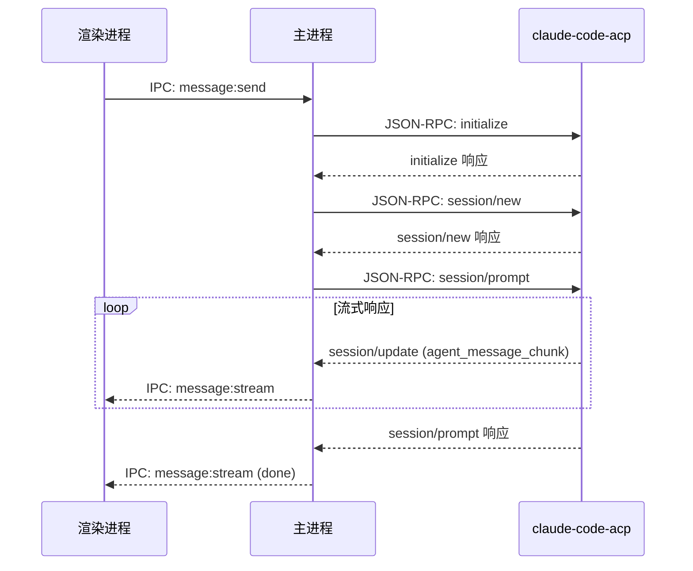

# ACP 协议集成架构

> 从 Claude SDK 直接调用改造为 ACP (Agent Client Protocol) 协议通信

## 架构对比

### v1.0 架构 (Claude SDK)

```
渲染进程 → IPC → 主进程 → Anthropic SDK → Anthropic API
```

- 直接使用 `@anthropic-ai/sdk` 调用 API
- 缺少 Claude Code Agent 的完整能力（工具调用、文件操作等）

### v2.0 架构 (ACP 协议)

```
渲染进程 → IPC → 主进程 (ACPClient) → stdio (JSON-RPC) → claude-code-acp → Anthropic API
```

- 使用 ACP 协议与 Claude Code Agent 通信
- 支持完整的 Agent 能力：文件读写、终端执行、工具调用
- 流式响应通过 `session/update` 通知推送

## 核心组件

### ACPClient

位置: `src/main/acp/ACPClient.ts`

职责:
- 管理与 Agent 子进程的生命周期
- 处理 JSON-RPC 消息的发送和接收
- 维护多个 ACPSession 实例

关键方法:
- `connect()` - 启动子进程并建立连接
- `newSession()` - 创建新会话
- `disconnect()` - 断开连接

### ACPSession

位置: `src/main/acp/ACPSession.ts`

职责:
- 封装单个会话的操作
- 处理 prompt 发送和响应

关键方法:
- `prompt(content, onUpdate)` - 发送消息并接收流式更新
- `cancel()` - 取消当前请求

### SessionManager

位置: `src/main/managers/SessionManager.ts`

职责:
- 管理 ACPClient 单例
- 维护 conversation 到 session 的映射
- 转发 session/update 到渲染进程

## ACP 消息流程



## 数据结构注意事项

### session/update 通知格式

claude-code-acp 返回的 `session/update` 通知有嵌套结构:

```json
{
  "sessionId": "xxx",
  "update": {
    "sessionUpdate": "agent_message_chunk",
    "content": {
      "type": "text",
      "text": "响应内容..."
    }
  }
}
```

需要解包 `update` 字段获取实际数据。

## 配置

### Agent 命令

默认使用 `claude-code-acp`，可通过 `~/.claude/settings.json` 自定义:

```json
{
  "agentCommand": ["claude-code-acp"]
}
```

### API Key 注入

从 `~/.claude/settings.json` 读取并注入到子进程环境变量:

```json
{
  "env": {
    "ANTHROPIC_API_KEY": "sk-ant-..."
  }
}
```

## 依赖

- `@zed-industries/claude-code-acp` - ACP 适配器 (全局安装)
- JSON-RPC 2.0 协议 over stdio

---

*创建: 2026-01-31*
